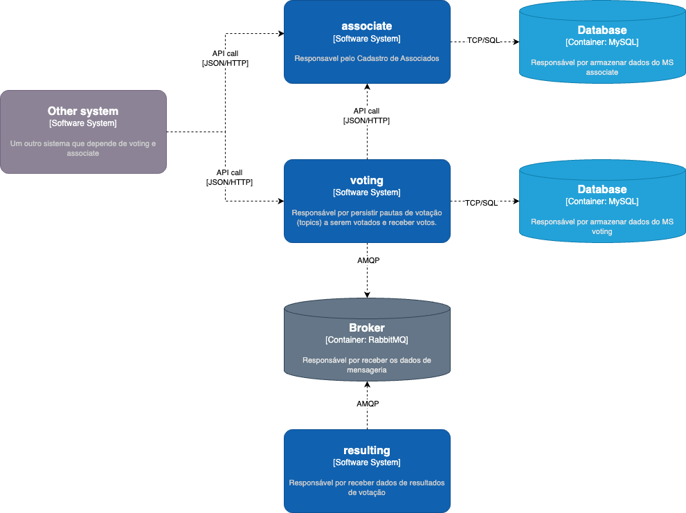
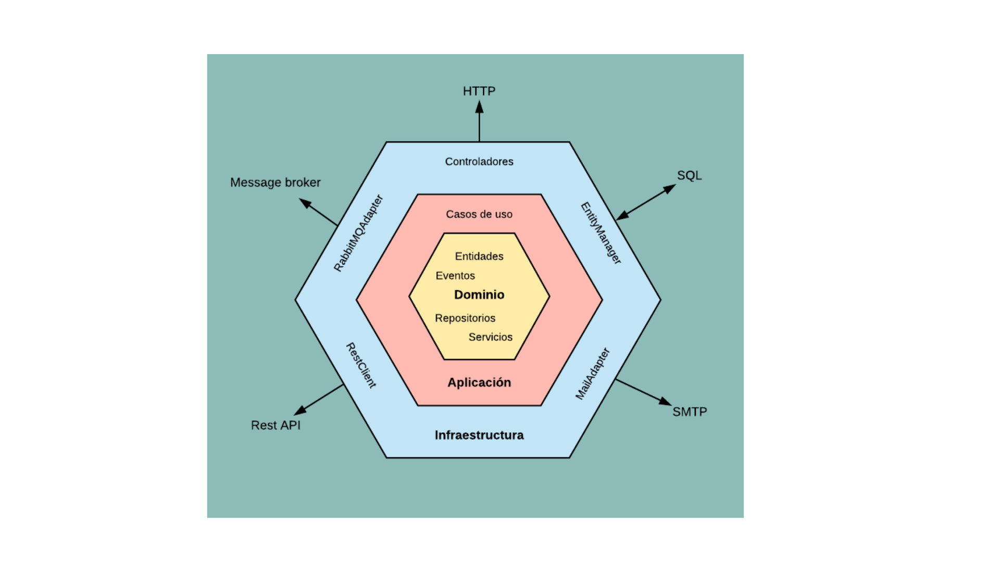

# Sistema de Votação Distribuída

Este projeto foi feito como resolução de desafio proposto para um problema de votação de associados em pautas. 

Foi feito um sistema distribuído composto por três microsserviços: **voting**, **resulting** e **associate** que interagem por meio de um barramento de mensagens RabbitMQ e bancos de dados MySQL.


## Microserviços e Desenho arquitetural

- `associate`: Gerenciar informações sobre os associados, incluindo cadastro e consulta de status de votação.
    - persistir associado
    - consultar status de votação de um associado (ABLE_TO_VOTE ou UNABLE_TO_VOTE)
- `voting`: Registrar os votos dos associados em um tópico.
    - persistir um novo tópico (assunto de votação)
    - abrir um tópico para votação
    - receber um voto (valida no asssociate se associado pode votar)
    - fechar o tópico após o término do tempo de aberto e enviar resultado da votação para broker
- `resulting`: Obter resultado de votação
    - obtém do broker e somente gera log com o resultado
    - O microsserviço `voting` publica uma mensagem no RabbitMQ contendo o resultado da votação. O microsserviço `resulting` possui um *listener* configurado para consumir mensagens desse tópico específico. Ao receber a mensagem, o `resulting` processa os dados e armazena o resultado final.



## Estruturação do Código: Arquitetura Hexagonal


Para estruturação do código, foi escolhido a arquitetura hexagonal, também conhecida como arquitetura de portas e adaptadores, como forma de implementação. 

Essa escolha ocorreu devido a sua capacidade de isolar o núcleo de negócio da aplicação das dependências. Essa abordagem oferece diversas vantagens, sendo a principal delas o baixo acoplamento entre os componentes que facilita a manutenção e a evolução do sistema.



## Endpoints

### Associate

- `POST /v1/associate` Cadastra um novo associado.

```bash
curl --location 'http://localhost:8080/v1/associate' \
--header 'Content-Type: application/json' \
--data '{
    "cpf": "67818065059",
    "ableToVote": true
}'
```

- `GET /v1/associate/status/{cpf}` Consulta o status de votação de um associado.

```bash
curl --location --request GET 'http://localhost:8080/v1/associate/status/67818065059' \
--header 'Content-Type: application/json'
```

### Voting

- `POST /v1/topics` Cria um novo tópico.

```bash
curl --location 'http://localhost:8081/v1/topics' \
--header 'Content-Type: application/json' \
--data '{
    "name": "P6",
    "duration": 20
}'
```

- `POST /v1/topics/open/{id}` Abre um tópico para votação.

```bash
curl --location --request POST 'http://localhost:8081/v1/topics/open/7f000001-94c9-149e-8194-c9355ca30000' \
```

- `GET /v1/topics/query` Lista os tópicos com paginação.

```bash
curl --location --request GET 'http://localhost:8081/v1/topics/query?pageSize=10&pageNumber=0' \
--header 'Content-Type: application/json'
```

- `POST /v1/votes` Registra um voto.

```bash
curl --location 'http://localhost:8081/v1/votes' \
--header 'Content-Type: application/json' \
--data '{
    "topicId": "7f000001-94c9-149e-8194-c9355ca30000",
    "cpf": "67818065059",
    "option": true
}'
```

## Como Executar

1. Clone este repositório.
2. Execute na raiz `docker-compose up -d` para subir o rabbitmq e as instâncias de banco de dados.
2.  Execute os microsserviços individualmente (ajuste as portas se necessário):
    *   `cd associate && ./mvnw spring-boot:run` (porta 8080)
    *   `cd voting && ./mvnw spring-boot:run` (porta 8081)
    *   `cd resulting && ./mvnw spring-boot:run`
3.  Acesse a documentação da API em `http://localhost:8080/swagger-ui.html` (associate) e `http://localhost:8081/swagger-ui.html` (voting).

