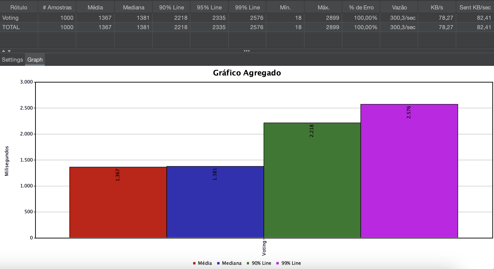

# Sistema de Votação

Este projeto foi feito como resolução de desafio proposto para um problema de votação de associados em pautas/assuntos. 

Foi feito um sistema distribuído composto por três microsserviços: **voting**, **resulting** e **associate** que interagem por meio de um barramento de mensagens RabbitMQ e bancos de dados MySQL.


## Microserviços e Desenho arquitetural

- `associate`: Gerencia informações sobre os associados, incluindo cadastro e consulta de status de votação.
    - persistir associado
    - consultar status de votação de um associado (verificar se está apto para votar)
- `voting`: Registra os votos dos associados em um tópico e fecha o mesmo após seu tempo previsto aberto.
    - persistir um novo tópico (assunto de votação). Nesse caso é enviado um parâmetro em minutos do tempo que terá aberto (quando aberto). Caso não seja enviado o valor default é 1 minuto.
    - abrir um tópico para votação e já agendar seu fechamento via schedule no tempo previsto desse tópico ficar aberto.
    - persistir um voto (se o tópico estiver aberto e se o associado está apto a votar - informação obtida a partir de uma consulta ao ms `associate`).
    - fechar o tópico após o término do tempo de aberto e enviar resultado da votação para broker. Esse fechamento ocorre devido a uma schedule criada em tempo de execução no momento que o tópico é aberto para votação.
- `resulting`: Obter resultado de votação
    - obtém do broker e somente gera log com o resultado
    - O microsserviço `voting` publica uma mensagem no RabbitMQ contendo o resultado da votação. O microsserviço `resulting` possui um *listener* configurado para consumir mensagens desse tópico específico. Ao receber a mensagem, o `resulting` faz a apenas a leitura do dado.


## Estruturação do Código: Arquitetura Hexagonal

Para estruturação do código, foi escolhido a arquitetura hexagonal, também conhecida como arquitetura de portas e adaptadores, como forma de implementação. 

Essa escolha ocorreu devido a sua capacidade de isolar o núcleo de negócio da aplicação das dependências. Essa abordagem oferece diversas vantagens, sendo a principal delas o baixo acoplamento entre os componentes que facilita a manutenção e a evolução do sistema.


## Endpoints

### Associate

- `POST /v1/associate` Cadastra um novo associado.

```bash
curl --location 'http://localhost:8080/v1/associate' \
--header 'Content-Type: application/json' \
--data '{
    "cpf": "67818065059",
    "ableToVote": true
}'
```

- `GET /v1/associate/status/{cpf}` Consulta o status de votação de um associado.

```bash
curl --location --request GET 'http://localhost:8080/v1/associate/status/67818065059' \
--header 'Content-Type: application/json'
```

### Voting

- `POST /v1/topics` Cria um novo tópico.

```bash
curl --location 'http://localhost:8081/v1/topics' \
--header 'Content-Type: application/json' \
--data '{
    "name": "P6",
    "duration": 20
}'
```

- `POST /v1/topics/open/{id}` Abre um tópico para votação.

```bash
curl --location --request POST 'http://localhost:8081/v1/topics/open/7f000001-94c9-149e-8194-c9355ca30000' \
```

- `GET /v1/topics/query` Lista os tópicos com paginação.

```bash
curl --location --request GET 'http://localhost:8081/v1/topics/query?pageSize=10&pageNumber=0' \
--header 'Content-Type: application/json'
```

- `POST /v1/votes` Registra um voto.

```bash
curl --location 'http://localhost:8081/v1/votes' \
--header 'Content-Type: application/json' \
--data '{
    "topicId": "7f000001-94c9-149e-8194-c9355ca30000",
    "cpf": "67818065059",
    "option": true
}'
```

## Como Executar

1. Clone este repositório.
2. Execute na raiz `docker-compose up -d` para subir o rabbitmq e as instâncias de banco de dados.
2.  Execute os microsserviços individualmente (ajuste as portas se necessário):
    *   `cd associate && ./mvnw spring-boot:run` (porta 8080)
    *   `cd voting && ./mvnw spring-boot:run` (porta 8081)
    *   `cd resulting && ./mvnw spring-boot:run`
3.  Acesse a documentação da API em `http://localhost:8080/swagger-ui.html` (associate) e `http://localhost:8081/swagger-ui.html` (voting).

## Análise de Performance

Foram feitas análises básicas de performance da API com a infra local (máquina de desenvolvimento), rodando apenas uma instância dos serviços `associate` e `voting`, usando o software [Apache JMeter](https://jmeter.apache.org).

Como a operação mais crítica poderia ser os votos, analisei alguns cenários básicos relativo a esse endpoint / operação.

Obs.: na tabela aparece % de erro total pois são feitas validações que geram status de retorno 4XX (404, 409...).

### Cenário 1 - Requisição que termina no voting
No primeiro momento foi avaliado o cenário de `500 requisições` disparadas para a situação de tópico não aberto e/ou inválido.
Nesse caso é feito a validação no próprio serviço `voting` e assim o retorno é mais rápido.
Segue abaixo o resultado com **mais de 99% das requisições tendo no máximo 200 milisegundos**.


Foi avaliado também o cenário com `1000 requisições`, com as requisição terminando no `voting`.
Segue abaixo o resultado.


Percebemos que mesmo com 1000 requisições disparadas, o serviço ainda responde em **menos de 1 segundo em mais de 99% delas**.

### Cenário 2 - Requisição que `voting` consulta `associate`
No segundo momento foi avaliado o cenário de `500 requisições` disparadas. Nesse caso, o tópico está aberto para votação e portanto o `voting` chega a consultar o serviço `associate` para verificar o status do associado (apto ou não apto para votar). Ou seja, é uma análise do quanto o efeito de ir em outro serviço que consulta um banco de dados toda vez que é feito a requisição.

Segue abaixo o resultado para `500 requisições` disparadas.


Segue abaixo o resultado para `1000 requisições` disparadas.


Percebemos que com 1000 requisições disparadas, o serviço já se encontra em cenário crítico (considerando a infra local), e existem melhorias de arquitetura que poderiam ser discutidas considerando outros aspectos do negócio. 
Exemplos: cache na consulta do banco do serviço `voting`.

Uma consideração é que foi feito nesse projeto nesse momento um mecanismo de timeout e retry no caso da consulta `voting` --> `associate`, para caso o serviço `associate` esteja demorando, é encerrado a conexão e solicitado novo request.
No entanto, melhorias poderiam ser feitas implementando o padrão `circuit break` para evitar sobrecarregar o serviço `associate` caso ele já esteja em dificuldade de processamento. 